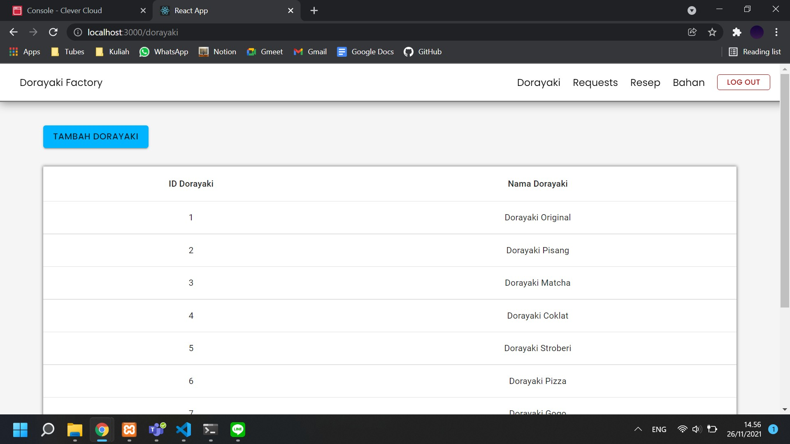
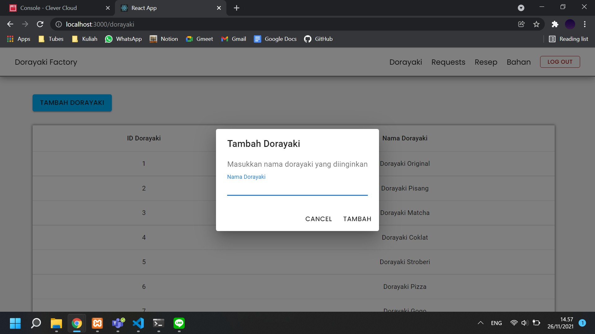
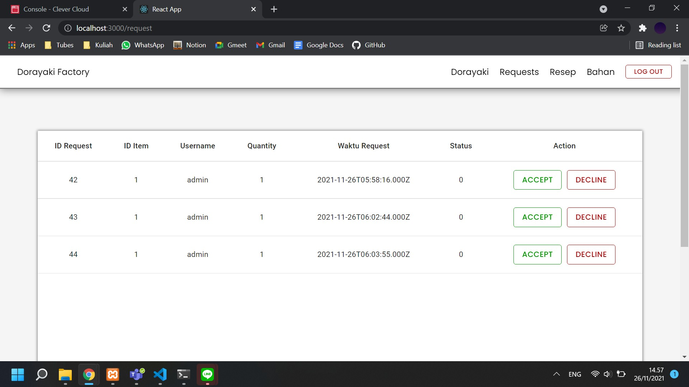
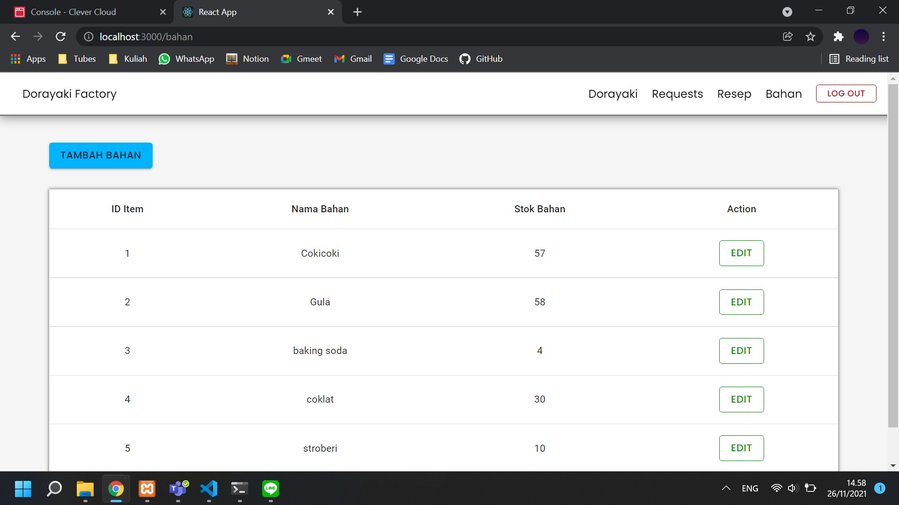
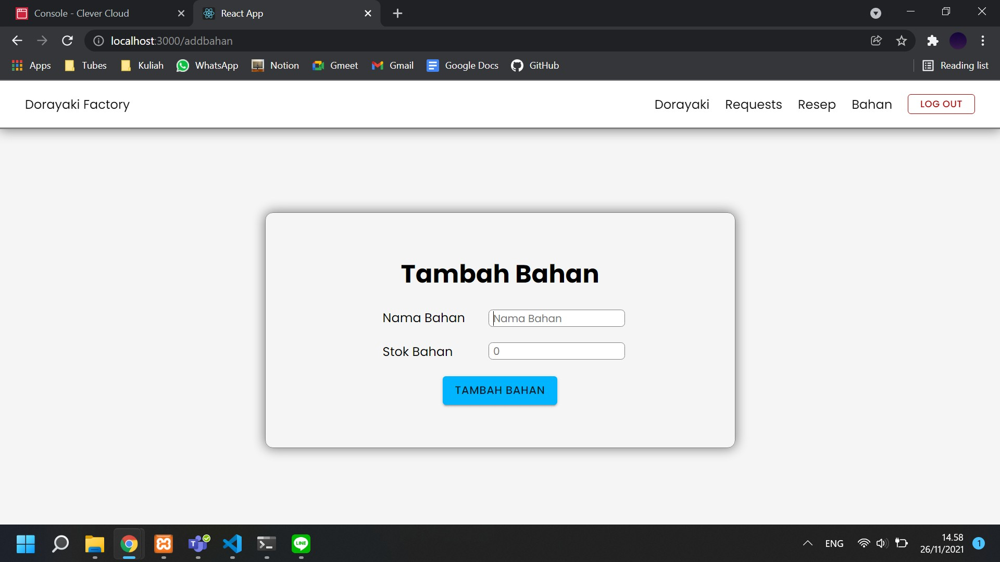
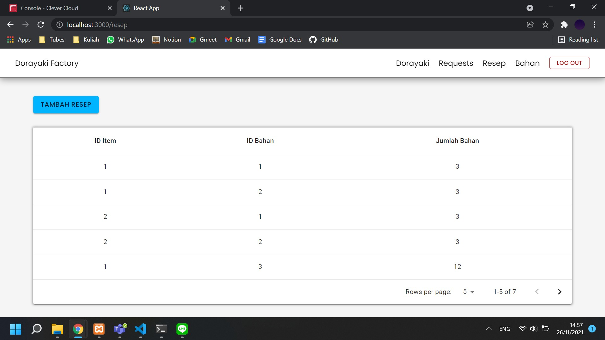
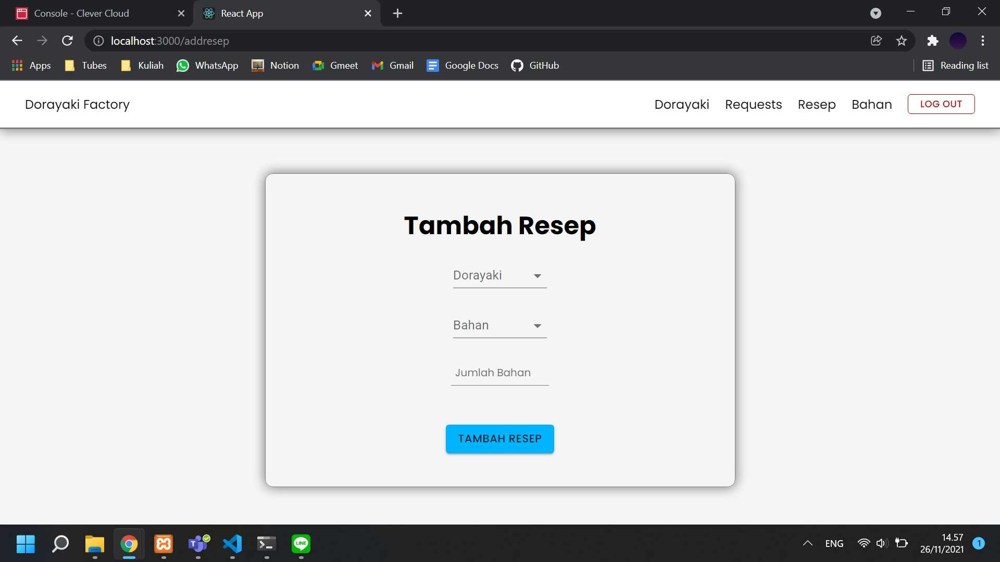

# Dorayaki-Factory-Client

# Deskripsi singkat aplikasi
Aplikasi Doradora factory merupakan aplikasi jual beli pusat dorayaki yang menyediakan berbagai jenis dorayaki untuk toko-toko online yang ada di di indonesia.

## screenshot
1. login

2. register

3. dorayaki page

4. tambah dorayaki

5. request dorayaki

6. bahan

7. tambah bahan

8. resep

9. tambah resep

## Pembagian tugas

Node.JS
front end pabrik fungsi request dorayaki : 13519161, 13519071, 13519027
front end pabrik fungsi bahan : 13519027
front end pabrik fungsi resep : 13519071, 13519027
front end pabrik fungsi login : 13519161, 13519027
front end pabrik fungsi register : 13519071, 13519027
front end pabrik fungsi notif email : 13519027
